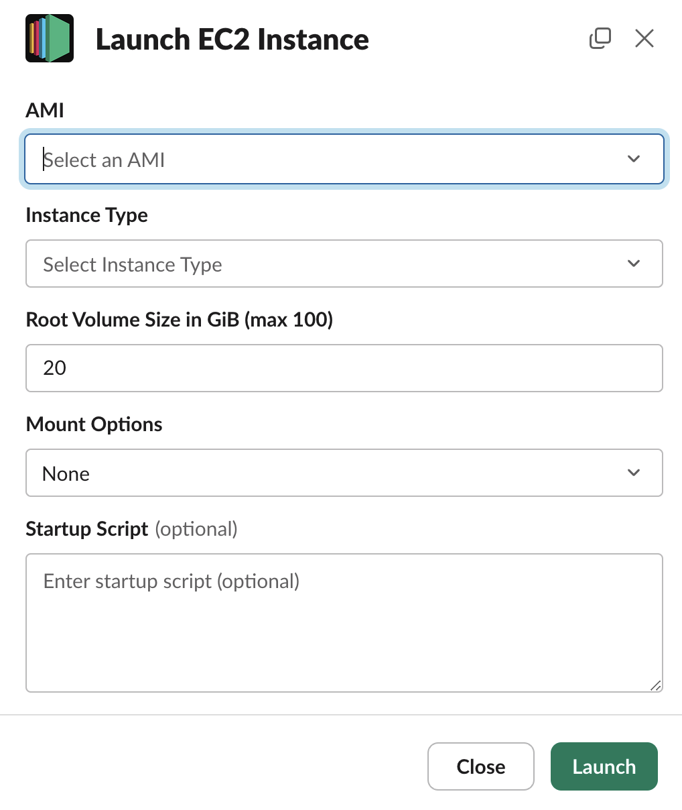

# Slackbot for AWS EC2 Management  [](https://codecov.io/github/teticio/ec2-slackbot)

This repository contains a Slackbot that allows you to manage AWS EC2 instances directly from Slack. The bot is built with Python, using Flask for the web server and the `slack-sdk` for interacting with the Slack API.



## Features

- Launch EC2 instances for connecting with SSH.
- Start, stop and terminate EC2 instances.
- Change EC2 instance type.
- Create, attach, detach, and destroy EBS volumes.
- Optionally mount SageMaker Studio EFS or EBS volume.
- Warn users to consider terminating long-running EC2 instances.

## Usage

The bot is designed to be used with Slack slash commands. The following commands are supported:

| Command               | Description                                                                 |
|-----------------------|-----------------------------------------------------------------------------|
| `/ec2 key`            | **Upload your public SSH key for EC2 instances.** This opens a modal where you can paste your public key. |
| `/ec2 up`             | **Launch an EC2 instance.** This opens a modal where you can select the AMI, instance type, and other options. |
| `/ec2 down`           | **Terminate running EC2 instances.** This opens a modal where you can select the instances to terminate. |
| `/ec2 change`         | **Modify the configuration of a running EC2 instance.** This opens a modal where you can select the instance and the new instance type. |
| `/ec2 start`          | **Start stopped EC2 instances.** This opens a modal where you can select the instances to start. |
| `/ec2 stop`           | **Stop running EC2 instances.** This opens a modal where you can select the instances to stop. |
| `/ebs create`         | **Create the EBS volume (limited to one per user).** This opens a modal where you can select the size. |
| `/ebs resize`         | **Resize the EBS volume.** This opens a modal where you can select the new size. |
| `/ebs attach`         | **Attach the EBS volume to an EC2 instance.** This opens a modal where you can select the instance to attach to. |
| `/ebs detach`         | **Detach the EBS volume from any EC2 instances.** |
| `/ebs destroy please` | **Destroy the EBS volume.**                                                     |

## Configuration

The bot's configuration is stored in a `config.yaml` file. An example configuration is provided in [`config.yaml.example`](config.yaml.example). The configuration includes AWS region, subnet, and security group details, as well as AMI and instance type options.

## SSM (Simple Systems Manager)

The instances establish a connection using SSH over SSM.

The following steps need to be performed on AWS:

1. Create a role and attach the `AmazonSSMManagedInstanceCore` policy to it. Then, set the `iam_instance_profile` in `config.yaml` to the name of this profile.
2. If your `subnet` is private, you will need to [configure your VPC endpoints](https://repost.aws/knowledge-center/ec2-systems-manager-vpc-endpoints) to allow SSM connections.
3. Make sure your AWS account is set to have an "advanced activation tier":

    ```bash
    aws ssm update-service-setting \
        --setting-id arn:aws:ssm:<region>:<account>:servicesetting/ssm/managed-instance/activation-tier \
        --setting-value advanced
    ```

4. Ensure that the IAM policy for the user includes the following permissions to start an SSM session:

    ```json
    {
        "Version": "2012-10-17",
        "Statement": [
            {
                "Effect": "Allow",
                "Action": "ssm:StartSession",
                "Resource": [
                    "arn:aws:ec2:*",
                    "arn:aws:ssm:*:*:document/AWS-StartSSHSession"
                ],
                "Condition": {
                    "BoolIfExists": {
                        "ssm:SessionDocumentAccessCheck": "true"
                    }
                }
            }
        ]
    }
    ```

For your local machine, users need to:

1. [Install the Session Manager plugin](https://docs.aws.amazon.com/systems-manager/latest/userguide/session-manager-working-with-install-plugin.html).
2. Insert the following lines into `~/.ssh/config`:

    ```bash
    # >>> AWS SSM config >>>
    Host i-* mi-*
        StrictHostKeyChecking accept-new
        ForwardAgent yes
        ServerAliveInterval 60
        ServerAliveCountMax 10000
        ProxyCommand aws ssm start-session --target %h --document-name AWS-StartSSHSession --parameters "portNumber=%p"
    # <<< AWS SSM config <<<
    ```

After these configurations, users can SSH into instances using:

```bash
ssh ubuntu@i-...  # i-... is the instance id
```

## Mount SageMaker Studio EFS

The "classic" version of SageMaker Studio mounts a shared EFS drive on all instances. One key advantage of using a regular EC2 instance is the ability to run `docker` directly, unlike SageMaker Studio apps which operate within a docker container.

In order to mount the EFS folder associated with the Slack user, you need to specify the `efs_ip` of the EFS that corresponds to the `subnet`, and the `sagemaker_studio_domain_id` in the `config.yaml` file. Additionally, the `security_groups` should incorporate the `security-group-for-outbound-nfs` used by SageMaker Studio. The Slack user name should correspond to the SageMaker Studio user name (except that dots are replaced with hyphens).

## Mount EBS

Every Slack user can create an EBS volume with the `/ec2 create_volume` command, which they can mount at `$HOME`. During the initial setup, the volume will be formatted, and the `$HOME` directory will be configured. EBS volumes offer higher performance compared to EFS due to their non-networked nature, but they are typically limited to being attached to a single EC2 instance at a time.

If you choose not to mount the EBS at `$HOME`, you can use it as an additional device. For more details, refer to the section "Common Operations with EBS Volumes".

**Note:** EBS volumes of type `io1` and `io2` support multi-attach, but this requires a cluster setup.

## Deployment Steps

1. Install the necessary dependencies by running `make install` in your terminal. Alternatively you can run `pip install ec2-slackbot`.
2. Create a new [Slack app](https://api.slack.com/apps). This app will interact with your deployment.
3. Update the `.env` file with your `SLACK_BOT_TOKEN` and `SLACK_SIGNING_SECRET`. These are essential for the Slack app to function correctly.
4. Start the application by executing `make run` or `ec2-slackbot --config=config.yaml` in your terminal. This will start the server on port 3000. To make the server accessible publicly, you can use a tool like `ngrok` to forward the port.
5. Configure your Slack app with the following manifest settings:

    ```yaml
    ...
    features:
      bot_user:
        display_name: EC2
        always_online: false
      slash_commands:
        - command: /ec2
          url: https://<your-url>/slack/commands
          description: EC2
          usage_hint: key | up | down | change | start | stop
          should_escape: false
        - command: /ebs
          url: https://<your-url>/slack/commands
          description: EBS
          usage_hint: create | resize | attach | detach | destroy
          should_escape: false
    oauth_config:
      scopes:
        bot:
          - chat:write
          - commands
          - im:write
          - users:read
    settings:
      interactivity:
        is_enabled: true
        request_url: https://<your-url>/slack/events
    ...
    ```

6. Ensure the IAM role assigned to `ec2-slackbot` includes the following permissions to manage EC2 instances and EBS volumes:

    ```json
    {
        "Version": "2012-10-17",
        "Statement": [
            {
                "Effect": "Allow",
                "Action": [
                    "ec2:DescribeInstances",
                    "ec2:RunInstances",
                    "ec2:TerminateInstances",
                    "ec2:DescribeVolumes",
                    "ec2:StopInstances",
                    "ec2:StartInstances",
                    "ec2:ModifyInstanceAttribute",
                    "ec2:CreateVolume",
                    "ec2:DeleteVolume",
                    "ec2:AttachVolume",
                    "ec2:DetachVolume",
                    "ec2:ModifyVolume",
                    "ec2:DescribeKeyPairs",
                    "ec2:ImportKeyPair",
                    "ec2:DeleteKeyPair",
                    "sagemaker:DescribeUserProfile",
                    "iam:PassRole"
                ],
                "Resource": [
                    "arn:aws:ec2:*",
                    "arn:aws:sagemaker:*",
                    "arn:aws:iam:*"
                ]
            }
        ]
    }
    ```

## Common Operations with EBS Volumes

The EBS device will either be `/dev/xvdh` or `/dev/nvme1n1` depending on the type of the EC2 instance.

```bash
if [ -e /dev/xvdh ]; then
    device=/dev/xvdh
elif [ -e /dev/nvme2n1 ]; then
    device=/dev/nvme2n1
else
    device=/dev/nvme1n1
fi
```

To format the EBS volume:

```bash
sudo mkfs -L ebs_volume -t ext4 $device
```

To mount the EBS volume at `/mnt` and ensure it is mounted automatically after a reboot:

```bash
echo "LABEL=ebs_volume /mnt ext4 defaults,nofail 0 2" | sudo tee -a /etc/fstab
sudo mount /mnt
```

If you resize the EBS volume with `/ec2 resize_volume` then you will need to run

```bash
sudo resize2fs $device
```

## Development

If you want to make changes to the code, it is recommended that you run `make install-dev` to install the development dependencies. This will install the necessary packages for testing and formatting the code, as well as the `pre-commit` hooks.

Tests can be run using `make test`. The tests are run using `localstack` to simulate AWS services locally. For this to work, you need to have `docker` and the `docker compose` plugin installed on your machine. Once you have finished testing, you can stop `localstack` by running `make stop-localstack`.

Alternatively, you run the tests on your AWS infrastructure with `make test-on-aws`. This will run the tests on your AWS account, so make sure you have the necessary permissions and configurations set up.

If you want to test the app in Slack before deploying to production, you can either deploy it in a separate Slack workspace or you can set the environment variable `EC2_SLACKBOT_STAGE` to `test-` and create a separate app which will respond to the commands `/test-ec2` and `/test-ebs`.

To debug the startup scripts, you can review the output in the `/var/log/cloud-init-output.log` file on the EC2 instance.
